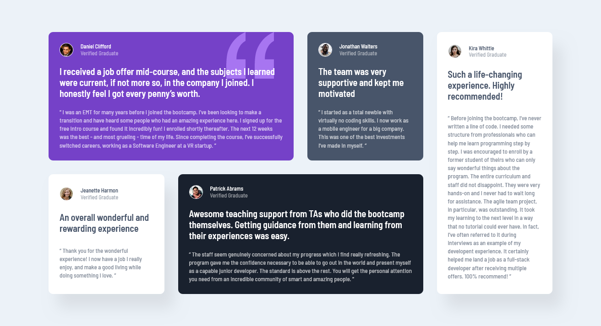

# Frontend Mentor - Testimonials grid section solution

This is a solution to the [Testimonials grid section challenge on Frontend Mentor](https://www.frontendmentor.io/challenges/testimonials-grid-section-Nnw6J7Un7). Frontend Mentor challenges help you improve your coding skills by building realistic projects.

## Table of contents

- [Overview](#overview)
  - [The challenge](#the-challenge)
  - [Screenshot](#screenshot)
  - [Links](#links)
- [My process](#my-process)
  - [Built with](#built-with)

## Overview

### The challenge

Users should be able to:

- View the optimal layout for the site depending on their device's screen size

### Screenshot



### Links

- [Solution](https://your-solution-url.com)
- [Live version](https://your-live-site-url.com)

## My process

### Built with

- Semantic HTML5 markup
- CSS custom properties
- Flexbox
- CSS Grid

### What I learned

```css
/* Placing the content in the center usin Grid */
body {
  min-height: 100vh;
  display: grid;
  place-content: center;
}

/* Changing the span and position on the grid */
.grid-col-span-2 {
  grid-column: span 2;
}

.card:last-child {
  grid-column-start: 4;
  grid-row: 1 / span 2;
}

/* Adding Image in css */
.card.quote {
  background-image: url("./images/bg-pattern-quotation.svg");
  background-repeat: no-repeat;
  background-position: top right 10%;
}
```
